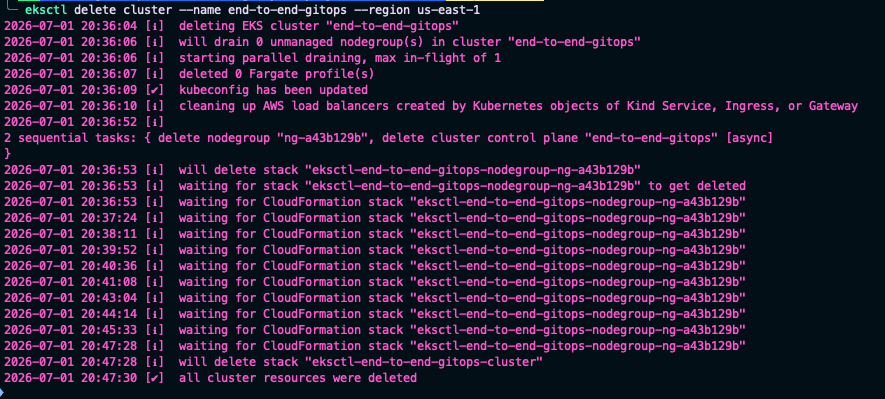

# CLEANUP.md

# Cleanup Guide

This document describes how to safely remove all resources created during this project.

Following these steps helps prevent unnecessary AWS charges and restores the local development environment.

---

# Resources Created

During this project, the following resources were created.

## Local

- Go Application
- Docker Images
- Docker Containers
- Helm Chart
- Local DNS Mapping (`/etc/hosts`)

---

## Kubernetes

- Deployment
- Service
- Ingress
- NGINX Ingress Controller
- Argo CD
- Helm Release

---

## AWS

- Amazon EKS Cluster
- Worker Nodes
- Elastic Load Balancer
- Security Groups
- EC2 Instances
- IAM Resources (managed by eksctl)

---

# Step 1 - Remove the Helm Release

If the application is still deployed through Helm, uninstall the release.

List installed releases.

```bash
helm list
```

Remove the release.

```bash
helm uninstall go-web-app
```

Verify.

```bash
kubectl get all
```

The application Deployment, Pods, and Service should no longer exist.

---

# Step 2 - Remove Argo CD (Optional)

If Argo CD will no longer be used, delete the namespace.

```bash
kubectl delete namespace argocd
```

Verify.

```bash
kubectl get ns
```

The `argocd` namespace should no longer be listed.

---

# Step 3 - Remove the NGINX Ingress Controller (Optional)

Delete the controller using the same manifest used during installation.

```bash
kubectl delete -f https://raw.githubusercontent.com/kubernetes/ingress-nginx/controller-v1.11.1/deploy/static/provider/aws/deploy.yaml
```

Verify.

```bash
kubectl get ns
```

The `ingress-nginx` namespace should eventually be removed.

---

# Step 4 - Delete the Amazon EKS Cluster

Deleting the EKS cluster automatically removes:

- Worker Nodes
- Auto Scaling Group
- Security Groups
- CloudFormation Stack
- Associated networking resources created by `eksctl`

Delete the cluster.

```bash
eksctl delete cluster \
--name go-web-app \
--region us-east-1
```

> **Note**
>
> Cluster deletion typically takes between **10–20 minutes**.

---





---

# Step 5 - Verify AWS Resource Cleanup

Open the AWS Console and verify that the following resources have been removed.

## Amazon EKS

- Cluster no longer exists

---

## EC2

- No worker nodes remain

---

## Load Balancers

- Application Load Balancer removed

---

## Target Groups

- No target groups remain

---

## Security Groups

- Security groups created by EKS have been deleted

---

## CloudFormation

The stack created by `eksctl` should no longer exist.

---

# Step 6 - Remove Local Docker Images (Optional)

List local images.

```bash
docker images
```

Remove the project image.

```bash
docker rmi <dockerhub-username>/go-web-app:v1
```

Remove dangling images.

```bash
docker image prune
```

To remove all unused images.

```bash
docker image prune -a
```

---

# Step 7 - Remove Stopped Containers (Optional)

List containers.

```bash
docker ps -a
```

Remove stopped containers.

```bash
docker container prune
```

---

# Step 8 - Remove Unused Docker Volumes (Optional)

```bash
docker volume prune
```

---

# Step 9 - Restore Local DNS Configuration

If a custom hostname was added to `/etc/hosts`, remove the entry.

Open the hosts file.

```bash
sudo vim /etc/hosts
```

Remove the line similar to:

```text
<LOAD_BALANCER_IP> go-web.local
```

Save the file.

This restores normal DNS resolution on the local machine.

---

# Step 10 - Verify Local Environment

Confirm the following.

Docker Images

```bash
docker images
```

Containers

```bash
docker ps -a
```

Kubernetes

```bash
kubectl get all
```

Expected output:

```text
No resources found.
```

Helm

```bash
helm list
```

Expected output:

```text
No releases found.
```

---

# Cleanup Checklist

Before considering the project fully cleaned up, verify the following.

- Helm release removed
- Application resources deleted
- Argo CD removed (optional)
- NGINX Ingress Controller removed (optional)
- Amazon EKS cluster deleted
- Worker nodes terminated
- Load Balancer removed
- Target Groups removed
- Security Groups removed
- Docker images removed (optional)
- Docker containers removed (optional)
- Docker volumes cleaned (optional)
- `/etc/hosts` restored

---

# Cost Considerations

Amazon EKS resources continue to incur charges while running.

Always verify that the following resources have been deleted after completing the project:

- Amazon EKS Cluster
- EC2 Worker Nodes
- Elastic Load Balancers
- Elastic IPs (if applicable)
- Target Groups
- Security Groups
- CloudFormation Stacks

Regularly reviewing the AWS Billing Dashboard is a good practice after deleting cloud infrastructure.

---

# Project Teardown Complete

If every step above has been completed successfully:

- No Kubernetes resources remain
- No AWS infrastructure remains
- No Docker artifacts remain (optional)
- The local development environment has been restored

The project has now been fully cleaned up.