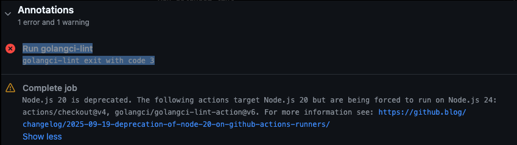

# HOWTO.md

# End-to-End DevOps Pipeline for a Go Web Application

This document provides a step-by-step implementation guide for deploying a Go web application on Amazon EKS using Docker, Kubernetes, Helm, GitHub Actions, and Argo CD.

Unlike the README, this document focuses on the implementation details, commands used, expected outcomes, and verification steps.

---

# Prerequisites

Before starting, ensure the following tools are installed and configured.

| Tool | Purpose |
|------|----------|
| Go | Build the application locally |
| Docker Desktop | Containerization |
| kubectl | Kubernetes CLI |
| eksctl | Create and manage EKS clusters |
| AWS CLI | Authenticate with AWS |
| Helm | Kubernetes Package Manager |
| Git | Source Control |
| GitHub Account | Store application source code |
| Docker Hub Account | Store container images |

Verify the installation.

```bash
go version

docker --version

kubectl version --client

eksctl version

aws --version

helm version
```

Configure AWS credentials.

```bash
aws configure
```

Provide:

- AWS Access Key
- AWS Secret Access Key
- Default Region
- Output Format

Verify the identity.

```bash
aws sts get-caller-identity
```

---

# Step 1 - Clone the Repository

Clone the application repository.

```bash
git clone <repository-url>

cd go-web-app
```

Verify the repository structure.

```bash
ls
```

You should see files similar to:

```text
Dockerfile
go.mod
go.sum
main.go
static/
```

---

# Step 2 - Test the Application Locally

Before containerizing the application, verify that it works correctly in a local environment.

Compile the application.

```bash
go build -o main .
```

Run the application.

```bash
./main
```

Expected output:

```text
Server started...
```

Open your browser.

```
http://localhost:8080
```

### Expected Issue

You may receive:

```
404 Page Not Found
```

This is expected because the application exposes its routes under the **/courses** endpoint.

Instead, open:

```
http://localhost:8080/courses
```

The application should now load successfully.

---


---

# Step 3 - Containerize the Application

The application will now be packaged into a Docker container.

A **multi-stage Docker build** is used.

Benefits include:

- Smaller image size
- Better security
- Faster deployments
- Cleaner runtime environment

Create the following Dockerfile.

```Dockerfile
FROM golang:1.22.5 AS builder

WORKDIR /app

COPY go.mod .

RUN go mod download

COPY . .

RUN go build -o main .

FROM gcr.io/distroless/base

COPY --from=builder /app/main .

COPY --from=builder /app/static ./static

EXPOSE 8080

CMD ["./main"]
```

### Why Multi-stage?

The Go compiler is only required while building the application.

The final container only needs the compiled binary.

This reduces the final image size significantly.

### Why Distroless?

Distroless images remove unnecessary operating system packages, reducing the attack surface while producing smaller production-ready containers.

---

# Step 4 - Build the Docker Image

Build the image.

```bash
docker build -t <dockerhub-username>/go-web-app .
```

### Possible Error

```
go.mod requires go >= 1.22.5
```

### Cause

The Go version specified inside the Dockerfile did not match the version defined inside **go.mod**.

### Solution

Update the Dockerfile.

```Dockerfile
FROM golang:1.22.5
```

Build again.

```bash
docker build -t <dockerhub-username>/go-web-app .
```

The image should build successfully.

---


---


---

# Step 5 - Verify the Docker Image

List the available images.

```bash
docker images
```

Expected output:

```text
REPOSITORY

go-web-app

TAG

latest
```

Run the container.

```bash
docker run -p 8080:8080 -it <dockerhub-username>/go-web-app
```

Open:

```
http://localhost:8080/courses
```

The application should load exactly as it did during local testing.

This confirms that the application has been successfully containerized.

---


---

# Step 6 - Push the Image to Docker Hub

Kubernetes worker nodes cannot use Docker images stored only on your local machine.

The image must be pushed to a container registry.

Login to Docker Hub.

```bash
docker login
```

Tag the image (if required).

```bash
docker tag go-web-app <dockerhub-username>/go-web-app:v1
```

Push the image.

```bash
docker push <dockerhub-username>/go-web-app:v1
```

Verify the upload by visiting your Docker Hub repository.

The image should now be visible along with its tag.

---


---


---

# Validation Checklist

Before proceeding to Kubernetes, verify the following:

- Application builds locally
- Application runs locally
- Docker image builds successfully
- Docker container starts successfully
- Application is accessible inside the container
- Image has been pushed to Docker Hub

At this stage, the application is fully containerized and ready to be deployed to Kubernetes.

---
# Chapter 2 - Deploying the Application to Amazon EKS

With the application successfully containerized and published to Docker Hub, the next step is deploying it to a Kubernetes cluster.

Amazon Elastic Kubernetes Service (EKS) provides a managed Kubernetes control plane, allowing us to focus on deploying applications instead of managing Kubernetes infrastructure.

In this chapter we will:

- Provision an Amazon EKS cluster
- Create Kubernetes Deployment, Service, and Ingress resources
- Deploy the application
- Troubleshoot deployment issues
- Verify application accessibility

---

# Step 7 - Create an Amazon EKS Cluster

This project uses **eksctl**, which simplifies provisioning an EKS cluster by creating all the required AWS resources automatically.

Before creating the cluster, verify that AWS CLI has been configured correctly.

```bash
aws sts get-caller-identity
```

Create the cluster.

```bash
eksctl create cluster \
    --name go-web-app \
    --region us-east-1
```

> **Note**
>
> Cluster creation typically takes between **20 and 30 minutes**. During this process, AWS provisions:
>
> - VPC (if required)
> - Worker Nodes
> - IAM Roles
> - Security Groups
> - EKS Control Plane

Once completed, verify that kubectl can communicate with the cluster.

```bash
kubectl get nodes
```

Expected output:

```text
NAME                     STATUS   ROLES    AGE

ip-xxx-xxx-xxx-xxx       Ready    <none>
```

If the node status is **Ready**, the cluster has been created successfully.

---


---


---

# Step 8 - Create the Kubernetes Deployment

A Deployment manages the desired number of application Pods and ensures they remain running even if individual Pods fail.

Create a file named:

```
deployment.yaml
```

The Deployment should include:

- Application image
- Replica count
- Container port
- Labels and selectors

Deploy it.

```bash
kubectl apply -f kubernetes/manifests/deployment.yaml
```

Verify the deployment.

```bash
kubectl get deployments
```

Check the Pods.

```bash
kubectl get pods
```

---

# Expected Issue - ImagePullBackOff

Initially, the Pod may remain in the following state:

```text
ImagePullBackOff
```

This indicates Kubernetes cannot successfully pull the application image.

Check Pod details.

```bash
kubectl describe pod <pod-name>
```

---


---

# Investigation

Several common causes were investigated:

- Incorrect image name
- Incorrect Docker Hub repository
- Authentication issues
- Missing image tag

The Docker image was rebuilt with an explicit version tag and pushed again.

```bash
docker tag go-web-app <dockerhub-username>/go-web-app:v1

docker push <dockerhub-username>/go-web-app:v1
```

However, the issue persisted.

Further inspection of the Pod events revealed:

```text
no match for platform in manifest
```

The Docker image had only been built for the local architecture, while the EKS worker nodes required a different platform.

---

# Resolution - Build a Multi-Architecture Image

Docker Buildx was used to build an image compatible with multiple processor architectures.

```bash
docker buildx build \
    --platform linux/amd64,linux/arm64 \
    -t <dockerhub-username>/go-web-app:v1 \
    --push .
```

Restart the Deployment.

```bash
kubectl rollout restart deployment go-web-app
```

Verify the Pods again.

```bash
kubectl get pods
```

Expected output:

```text
NAME

go-web-app-xxxxx

STATUS

Running
```

---


---

# Step 9 - Create a Kubernetes Service

Pods receive dynamic IP addresses and may be recreated at any time.

A Service provides a stable endpoint through which traffic can consistently reach the application.

Create:

```
service.yaml
```

Apply the manifest.

```bash
kubectl apply -f kubernetes/manifests/service.yaml
```

Verify.

```bash
kubectl get svc
```

The Service should be created successfully.

---


---

# Step 10 - Create an Ingress Resource

Ingress provides HTTP routing rules that allow external traffic to reach services running inside the Kubernetes cluster.

Create:

```
ingress.yaml
```

The Ingress resource defines:

- Host
- Path
- Backend Service

Deploy it.

```bash
kubectl apply -f kubernetes/manifests/ingress.yaml
```

Verify.

```bash
kubectl get ingress
```

At this stage, you will likely notice that the **ADDRESS** field is empty.

Example:

```text
NAME

go-web-app

ADDRESS

<pending>
```

This is expected.

An Ingress resource only defines routing rules—it does not actually route traffic.

A separate Ingress Controller is responsible for implementing those rules.

This will be configured in the next chapter.

---


---

# Step 11 - Verify the Application Using a NodePort Service

Before configuring an Ingress Controller, it is useful to verify that the application itself is functioning correctly.

Temporarily edit the Service.

```bash
kubectl edit svc go-web-app
```

Change:

```yaml
type: ClusterIP
```

to

```yaml
type: NodePort
```

Save and exit.

Retrieve the worker node IP address.

```bash
kubectl get nodes -o wide
```

Retrieve the allocated NodePort.

```bash
kubectl get svc
```

Access the application using:

```
http://<NODE-IP>:<NODEPORT>/courses
```

If the application loads successfully, it confirms that:

- The Pod is healthy
- The Deployment is functioning correctly
- The Service is routing traffic properly

The only missing component is an Ingress Controller.

---


---

# Validation Checklist

Before proceeding, verify the following:

- Amazon EKS cluster is operational
- Worker nodes are in the **Ready** state
- Deployment has been created
- Pods are running
- Service has been created
- Application is reachable through NodePort
- Ingress resource has been created
- Ingress ADDRESS is pending (expected)

At this stage, the application is successfully running inside Amazon EKS.

The remaining task is exposing it externally using an Ingress Controller.

---
# Chapter 3 - Exposing the Application and Packaging with Helm

At this stage, the application is successfully running inside Amazon EKS.

The remaining challenge is exposing the application outside the Kubernetes cluster.

Simply creating an Ingress resource is not enough. Kubernetes requires an **Ingress Controller** to interpret the routing rules defined in the Ingress resource and route external traffic to the correct Service.

Once external access is verified, the Kubernetes manifests will be converted into a reusable Helm chart.

---

# Step 12 - Install the NGINX Ingress Controller

The NGINX Ingress Controller watches all Ingress resources in the cluster and automatically configures HTTP routing.

Install the controller using the official Kubernetes manifest.

```bash
kubectl apply -f https://raw.githubusercontent.com/kubernetes/ingress-nginx/controller-v1.11.1/deploy/static/provider/aws/deploy.yaml
```

The deployment creates several Kubernetes resources including:

- Namespace
- Deployment
- Services
- Admission Webhooks
- ConfigMaps

Verify the controller Pods.

```bash
kubectl get pods -n ingress-nginx
```

Wait until every Pod reaches the **Running** state.

Example:

```text
NAME

ingress-nginx-controller-xxxx

STATUS

Running
```

---


---

# Step 13 - Verify the Ingress Resource

Now that an Ingress Controller exists, Kubernetes can provision an external endpoint.

Check the Ingress again.

```bash
kubectl get ingress
```

This time, the ADDRESS column should contain an external hostname.

Example:

```text
NAME

go-web-app

ADDRESS

xxxxxxxx.us-east-1.elb.amazonaws.com
```

Unlike the previous chapter, the ADDRESS field should no longer be empty.

This confirms that the Ingress Controller has successfully processed the Ingress resource.

---


---

# Step 14 - Why the Application Still Returns 404

Attempting to open the Ingress hostname directly in a browser will likely return:

```text
404 Not Found
```

This is expected.

The Ingress manifest was configured with a specific **Host** value.

Example:

```yaml
host: go-web.local
```

The Ingress Controller compares the incoming HTTP Host header with the value defined in the manifest.

Since visiting the AWS hostname sends a different Host header, the request does not match any routing rule.

To resolve this, we need local DNS mapping.

---

# Step 15 - Configure Local DNS Mapping

Retrieve the IP address of the Ingress hostname.

```bash
nslookup <elb-address>
```

Copy the returned IP address.

Open the hosts file.

```bash
sudo vim /etc/hosts
```

Add an entry similar to:

```text
<IP_ADDRESS>     go-web.local
```

Save the file.

Now access the application using:

```
http://go-web.local/courses
```

The application should now load successfully.

This approach overrides local DNS resolution, allowing requests to use the Host value expected by the Ingress configuration.

---


---


---

# Step 16 - Verify External Access

At this point, verify the following:

- The Ingress Controller is running.
- The Ingress resource has an external address.
- DNS mapping has been configured.
- The application is accessible through the configured hostname.

The application is now publicly accessible through Kubernetes Ingress.

---

# Step 17 - Create a Helm Chart

Although the application is now successfully deployed, maintaining raw Kubernetes YAML files becomes increasingly difficult as projects grow.

Helm simplifies Kubernetes deployments by introducing reusable templates and centralized configuration.

Generate a new Helm chart.

```bash
helm create go-web-app-chart
```

Helm creates the following structure.

```text
go-web-app-chart/

Chart.yaml

values.yaml

templates/

charts/
```

Since this project already contains working Kubernetes manifests, the default templates are not required.

Remove the generated templates.

```bash
rm -rf go-web-app-chart/templates/*
```

Remove the charts directory.

```bash
rm -rf go-web-app-chart/charts
```

Copy the existing manifests.

```bash
cp -r kubernetes/manifests/* go-web-app-chart/templates/
```

The existing Deployment, Service, and Ingress resources will now become Helm templates.

---

# Step 18 - Parameterize the Deployment

Open:

```
deployment.yaml
```

Replace the image reference.

From:

```yaml
image: username/go-web-app:v1
```

To:

```yaml
image: "{{ .Values.image.repository }}:{{ .Values.image.tag }}"
```

This allows image versions to be managed through **values.yaml** rather than modifying the Deployment manifest.

Open:

```
values.yaml
```

Configure:

```yaml
replicaCount: 1

image:

  repository: username/go-web-app

  pullPolicy: IfNotPresent

  tag: "v1"
```

Future deployments now require updating only the image tag.

---

# Step 19 - Test the Helm Chart

Before installing the chart, remove the manually deployed resources.

Delete the Deployment.

```bash
kubectl delete deployment go-web-app
```

Delete the Service.

```bash
kubectl delete svc go-web-app
```

Delete the Ingress.

```bash
kubectl delete ingress go-web-app
```

Verify.

```bash
kubectl get all
```

The application resources should no longer exist.

Navigate to the Helm chart directory.

```bash
cd helm
```

Install the application.

```bash
helm install go-web-app ./go-web-app-chart
```

Verify the release.

```bash
helm list
```

Verify Kubernetes resources.

```bash
kubectl get all
```

The Deployment, Service, and Pods should be recreated by Helm.

---


---

# Step 20 - Verify Helm Uninstallation

Remove the Helm release.

```bash
helm uninstall go-web-app
```

Verify.

```bash
kubectl get all
```

All application resources should be removed.

This confirms that Helm is managing the lifecycle of the application.

---

# Validation Checklist

Before continuing, verify the following:

- NGINX Ingress Controller is running
- Ingress has an external address
- Local DNS mapping is configured
- Application is accessible through the configured hostname
- Helm chart has been created
- Deployment templates are parameterized
- Helm successfully installs the application
- Helm successfully removes the application

At this point, the application has evolved from manually managed Kubernetes manifests into a reusable, version-controlled Helm deployment.

---

# Chapter 4 - Automating Builds with GitHub Actions (Continuous Integration)

So far, every step in the deployment process has been performed manually.

Whenever the application changes, we would need to:

- Build the Go application
- Build the Docker image
- Push the image to Docker Hub

While this works for learning purposes, it quickly becomes repetitive and error-prone.

Continuous Integration (CI) automates this process by building and validating every change pushed to the repository.

In this chapter, we'll configure a GitHub Actions workflow to automatically build and publish our application whenever code is pushed to GitHub.

---

# Step 21 - Understanding the CI Pipeline

The GitHub Actions workflow performs the following tasks automatically:

```text
Developer Pushes Code

↓

GitHub Actions Triggered

↓

Checkout Repository

↓

Setup Go Environment

↓

Download Dependencies

↓

Run Static Analysis (golangci-lint)

↓

Build Docker Image

↓

Login to Docker Hub

↓

Push Docker Image
```

Every successful push results in a fresh Docker image published to Docker Hub.

---

# Step 22 - Create the GitHub Actions Workflow

Inside the project root, create the following directory.

```text
.github/workflows/
```

Create a new workflow.

```text
ci.yaml
```

Your project structure should now contain:

```text
.github/

└── workflows/

      └── ci.yaml
```

---

# Step 23 - Configure GitHub Secrets

Credentials should never be hardcoded inside a workflow.

Instead, GitHub provides encrypted repository secrets.

Navigate to:

```
Repository

↓

Settings

↓

Secrets and Variables

↓

Actions

↓

New Repository Secret
```

Create the required secrets.

| Secret | Purpose |
|---------|----------|
| DOCKER_USERNAME | Docker Hub Username |
| DOCKER_PASSWORD | Docker Hub Password or Access Token |

These secrets will be injected into the workflow during execution.

> **Best Practice**
>
> Always use repository secrets for credentials and sensitive configuration. Avoid committing passwords, tokens, or API keys to source control.

---


---

# Step 24 - Create the CI Workflow

The workflow performs the following operations:

1. Trigger on every push to the main branch
2. Checkout the repository
3. Configure Go
4. Download dependencies
5. Run the Go linter
6. Build the Docker image
7. Authenticate with Docker Hub
8. Push the image to Docker Hub

Save the completed workflow inside:

```text
.github/workflows/ci.yaml
```

Commit the changes.

```bash
git add .

git commit -m "Add GitHub Actions workflow"

git push
```

GitHub automatically detects the workflow and starts the pipeline.

---

# Step 25 - Monitor the Workflow

Navigate to:

```
Repository

↓

Actions
```

The workflow should begin executing automatically.

Initially, the workflow may display a yellow status while jobs are running.

Select the running workflow to monitor each stage.

Typical stages include:

- Checkout
- Setup Go
- Install Dependencies
- Lint
- Build Docker Image
- Docker Login
- Docker Push

---


---

# Step 26 - Troubleshooting the Linter

During the initial pipeline execution, the workflow may fail during the linting stage.

Example:

```text
golangci-lint exited with code 3
```

This issue was caused by an incompatible version of the GitHub Action.

Update the workflow.

Replace:

```yaml
golangci-lint-action
```

with:

```yaml
uses: golangci/golangci-lint-action@v8

with:

  version: v2.2.2
```

Commit the updated workflow.

```bash
git add .

git commit -m "Fix golangci-lint version"

git push
```

GitHub automatically starts a new workflow.

The pipeline should now complete successfully.

---





---


---

# Step 27 - Verify the Docker Image

Once the workflow completes successfully, verify that the image has been pushed to Docker Hub.

Open your Docker Hub repository.

A new image should now be available.

Verify:

- Repository
- Latest Tag
- Push Timestamp

This confirms that GitHub Actions successfully authenticated with Docker Hub and published the image.

---


---

# Step 28 - Verify the Pipeline

Return to the GitHub Actions page.

The workflow should now display a green checkmark.

This indicates that every stage completed successfully.

A successful workflow confirms that:

- Source code compiled successfully
- Dependencies resolved
- Static analysis passed
- Docker image built successfully
- Docker Hub authentication succeeded
- Image published successfully

---


---

# Why Continuous Integration Matters

Before implementing GitHub Actions, every build required manual execution.

```text
Developer

↓

Build Application

↓

Build Docker Image

↓

Login to Docker Hub

↓

Push Image
```

After implementing CI, the process becomes:

```text
Developer

↓

git push

↓

GitHub Actions

↓

Everything Happens Automatically
```

This eliminates repetitive manual work while ensuring every commit is validated and packaged consistently.

---

# Validation Checklist

Before moving to the next chapter, verify the following:

- GitHub Actions workflow exists
- Repository secrets are configured
- Workflow triggers automatically on push
- Docker image builds successfully
- Image is pushed to Docker Hub
- GitHub Actions workflow completes successfully

At this stage, the application has a fully automated Continuous Integration pipeline.

The only remaining step is automating deployments using GitOps.

---

# Chapter 5 - Continuous Deployment with Argo CD (GitOps)

At this stage, the application can be built automatically using GitHub Actions.

However, deployments are still manual.

Whenever a new Docker image is published, we would still need to manually deploy the updated version to Kubernetes.

GitOps solves this problem.

Instead of manually applying Kubernetes manifests, Git becomes the single source of truth for deployments.

Argo CD continuously monitors the Git repository and ensures the Kubernetes cluster always matches the desired state stored in Git.

---

# What is GitOps?

GitOps is a deployment strategy where Git repositories define the desired state of infrastructure and applications.

Instead of manually executing:

```bash
kubectl apply -f deployment.yaml
```

Argo CD continuously watches the repository and automatically applies changes whenever the repository is updated.

The deployment workflow now becomes:

```text
Developer

↓

git push

↓

GitHub Actions

↓

Docker Image

↓

Git Repository

↓

Argo CD

↓

Amazon EKS

↓

Application Updated
```

---

# Step 29 - Install Argo CD

Create a namespace.

```bash
kubectl create namespace argocd
```

Install Argo CD.

```bash
kubectl apply \
-n argocd \
-f https://raw.githubusercontent.com/argoproj/argo-cd/stable/manifests/install.yaml
```

The installation creates several Kubernetes resources including:

- Deployments
- Services
- ConfigMaps
- Secrets
- Roles
- RoleBindings

Wait a few minutes for all Pods to start.

Verify.

```bash
kubectl get pods -n argocd
```

All Pods should eventually reach the **Running** state.

---


---

# Step 30 - Expose the Argo CD UI

By default, the Argo CD server is only accessible within the Kubernetes cluster.

To access the web interface externally, change the Service type to **LoadBalancer**.

Patch the Service.

```bash
kubectl patch svc argocd-server \
-n argocd \
-p '{"spec":{"type":"LoadBalancer"}}'
```

Verify.

```bash
kubectl get svc -n argocd
```

Example:

```text
NAME

argocd-server

EXTERNAL-IP

xxxxxxxx.amazonaws.com
```

Open the external address in your browser.

The Argo CD login page should appear.

---

# Step 31 - Retrieve the Initial Admin Password

The default username is:

```text
admin
```

Retrieve the Secret.

```bash
kubectl get secrets -n argocd
```

View the Secret.

```bash
kubectl edit secret argocd-initial-admin-secret \
-n argocd
```

Copy the password.

Decode it.

```bash
echo <base64-password> | base64 --decode
```

Use the decoded value as the password.

Log in to the Argo CD dashboard.

---


---

# Step 32 - Create an Argo CD Application

Inside the Argo CD dashboard:

Click:

```
New App
```

Configure:

- Application Name
- Project
- Repository URL
- Revision
- Path
- Destination Cluster
- Namespace

If using Helm, point Argo CD to the Helm chart directory within the repository.

Review the configuration.

Click:

```
Create
```

Argo CD now begins comparing the Git repository against the current Kubernetes cluster.

---

# Step 33 - Synchronize the Application

Initially, the application may appear:

```text
OutOfSync
```

This simply means the cluster does not yet match the desired state stored in Git.

Click:

```
Sync
```

Confirm the synchronization.

Argo CD applies the manifests automatically.

Once complete, the application status should become:

```text
Healthy

Synced
```

This confirms the cluster matches the repository.

---


---


---

# Step 34 - Verify the Deployment

Return to Kubernetes.

```bash
kubectl get all
```

Verify:

- Deployment
- Pods
- Services
- ReplicaSets

All resources should now be managed by Argo CD.

The application should still be accessible through the configured hostname.

---


---

# Step 35 - Test the Complete CI/CD Pipeline

The best way to verify the pipeline is by making a small application change.

Modify one of the application's static files.

For example:

```text
Welcome to Go Web App
```

Change it to:

```text
Welcome to DevOps
```

Commit the change.

```bash
git add .

git commit -m "Update application content"

git push
```

Observe the deployment pipeline.

---

## Continuous Integration

GitHub Actions automatically performs:

- Checkout Repository
- Build Application
- Run Linter
- Build Docker Image
- Push Image to Docker Hub

Verify the workflow completes successfully.

---


---

## Continuous Deployment

Once the repository changes, Argo CD detects the updated manifests.

The application transitions through:

```text
OutOfSync

↓

Syncing

↓

Healthy

↓

Synced
```

No manual deployment commands are required.

---


---

## Verify the Updated Application

Refresh the application.

The updated content should now be visible.

This confirms that:

- GitHub Actions built the application
- Docker Hub received the new image
- Argo CD synchronized the cluster
- Kubernetes performed a rolling update
- The latest version is running successfully

---


---

# Understanding the Complete Deployment Flow

At this point, the project has evolved into a fully automated GitOps deployment pipeline.

```text
Developer

↓

Push Code

↓

GitHub Repository

↓

GitHub Actions

↓

Run Linter

↓

Build Docker Image

↓

Push Image to Docker Hub

↓

Argo CD Detects Change

↓

Synchronize Cluster

↓

Rolling Update

↓

Application Updated

↓

Users Receive Latest Version
```

No manual Kubernetes deployment commands are required after pushing code.

---

# Benefits of GitOps

Implementing GitOps provides several advantages:

- Declarative deployments
- Version-controlled infrastructure
- Automatic reconciliation
- Self-healing deployments
- Reduced manual intervention
- Consistent application state
- Easier rollback using Git history

---

# Validation Checklist

Before completing the project, verify the following:

- Argo CD is installed successfully
- Argo CD UI is accessible
- Initial admin credentials work
- Application is registered in Argo CD
- Application status is Healthy
- Application status is Synced
- GitHub Actions completes successfully
- Docker image is updated
- Argo CD detects repository changes
- Kubernetes automatically deploys the latest version
- Application reflects the latest changes

Congratulations!

You have successfully implemented a complete GitOps-based Continuous Deployment pipeline for a Go web application on Amazon EKS.

---

# Chapter 6 - Final Validation, Best Practices, and Project Completion

Congratulations!

At this stage, you have successfully implemented a complete end-to-end DevOps workflow for a Go web application using Docker, Kubernetes, Helm, GitHub Actions, Argo CD, and Amazon EKS.

This final chapter verifies that every component is functioning correctly and summarizes the complete deployment pipeline.

---

# Step 36 - Verify the Kubernetes Cluster

Confirm that the Kubernetes cluster is healthy.

```bash
kubectl get nodes
```

Expected output:

```text
NAME                        STATUS

ip-xxx-xxx-xxx-xxx          Ready
```

All worker nodes should be in the **Ready** state.

---

Verify all namespaces.

```bash
kubectl get ns
```

Expected namespaces include:

- default
- kube-system
- ingress-nginx
- argocd

---

# Step 37 - Verify the Application Resources

Confirm that the application resources are running successfully.

```bash
kubectl get all
```

Verify:

- Deployment
- ReplicaSet
- Pods
- Service

Every Pod should report:

```text
Running
```

No Pods should be in:

- CrashLoopBackOff
- ImagePullBackOff
- Pending

---

# Step 38 - Verify Ingress

Check the Ingress resource.

```bash
kubectl get ingress
```

Confirm:

- ADDRESS exists
- HOST is correct
- PORTS are configured

---

# Step 39 - Verify Helm

List installed releases.

```bash
helm list
```

Expected output:

```text
NAME

go-web-app
```

This confirms the application is managed through Helm rather than manually applied Kubernetes manifests.

---

# Step 40 - Verify Argo CD

Open the Argo CD dashboard.

Verify the application reports:

✅ Healthy

✅ Synced

If the application is OutOfSync, click **Refresh** followed by **Sync**.

Argo CD should reconcile the cluster automatically.

---

# Step 41 - Verify the Complete CI/CD Pipeline

The complete deployment pipeline should now resemble the following workflow.

```text
Developer

↓

Push Code

↓

GitHub

↓

GitHub Actions

↓

Run Linter

↓

Build Docker Image

↓

Push Docker Image

↓

Git Repository Updated

↓

Argo CD Detects Changes

↓

Synchronize Kubernetes

↓

Rolling Update

↓

Application Updated
```

No manual deployment commands are required after pushing code.

---

# Operational Best Practices

Although this project was built for learning purposes, several production-ready practices were followed.

## Multi-stage Docker Builds

Separating the build environment from the runtime image reduces image size while keeping containers secure.

---

## Distroless Runtime Images

The final runtime image contains only the application binary and its required runtime dependencies.

Benefits include:

- Smaller attack surface
- Smaller image size
- Faster deployments

---

## Kubernetes Deployments

Deployments provide:

- Replica management
- Rolling updates
- Self-healing Pods
- Declarative desired state

---

## Kubernetes Services

Services provide a stable endpoint for Pods, whose IP addresses are ephemeral and change over time.

---

## Kubernetes Ingress

Ingress enables HTTP routing using host and path-based rules.

Without an Ingress Controller, these rules remain inactive.

---

## Helm

Helm centralizes configuration, making deployments reusable and significantly easier to maintain across environments.

---

## GitHub Actions

Continuous Integration ensures every code change is automatically:

- Built
- Validated
- Packaged

before deployment.

---

## GitOps

Git serves as the single source of truth.

Infrastructure and application configuration remain version controlled and auditable.

---

## Argo CD

Argo CD continuously compares the desired state stored in Git with the actual cluster state.

If they differ, Argo CD automatically reconciles them.

---

# Lessons Learned

Throughout this project, the following concepts were explored in depth.

### Docker

- Multi-stage builds
- Distroless images
- Image tagging
- Multi-architecture builds

---

### Kubernetes

- Deployments
- ReplicaSets
- Pods
- Services
- Ingress
- Cluster networking

---

### Amazon EKS

- Managed Kubernetes
- Worker Nodes
- Cluster provisioning
- kubectl integration

---

### Helm

- Chart creation
- Template parameterization
- values.yaml
- Release management

---

### GitHub Actions

- Workflow automation
- Repository secrets
- Docker automation
- Continuous Integration

---

### Argo CD

- GitOps
- Continuous Deployment
- Automatic synchronization
- Cluster reconciliation

---

# Project Outcome

This project demonstrates an end-to-end implementation of modern DevOps practices.

Starting from a locally developed Go application, the project evolved into a fully automated deployment pipeline capable of:

- Building container images
- Publishing images to a registry
- Deploying to Kubernetes
- Packaging deployments using Helm
- Automating Continuous Integration
- Implementing GitOps Continuous Deployment
- Synchronizing Kubernetes clusters automatically

The resulting workflow closely resembles deployment pipelines commonly used in production cloud environments.

---

# Congratulations 

You have successfully implemented a complete DevOps pipeline using:

- Go
- Docker
- Kubernetes
- Amazon EKS
- Helm
- GitHub Actions
- Argo CD
- GitOps

This project brings together application development, containerization, orchestration, cloud infrastructure, automation, and continuous delivery into a single production-inspired workflow.

For resource cleanup, refer to **CLEANUP.md**.

For common deployment issues and resolutions, refer to **TROUBLESHOOTING.md**.