# End-to-End GitOps CI/CD Pipeline for a Go Web Application on Amazon EKS

> A complete DevOps implementation for a Go web application using Docker, Kubernetes, Helm, GitHub Actions, Argo CD, and Amazon EKS following modern GitOps practices.


---

# Project Overview

This project demonstrates a complete cloud-native DevOps workflow by deploying a Go web application to **Amazon Elastic Kubernetes Service (EKS)** using modern DevOps tools and GitOps practices.

The application is first containerized using a **multi-stage Docker build** with a **Distroless runtime image**, deployed onto Kubernetes, packaged using **Helm**, and finally automated through a CI/CD pipeline using **GitHub Actions** and **Argo CD**.

The objective of this project was not just to deploy an application, but to implement an end-to-end software delivery pipeline similar to what is used in production environments.

---

# Project Objectives

- Containerize a Go web application
- Deploy the application on Kubernetes
- Provision an Amazon EKS cluster
- Expose the application using Kubernetes Ingress
- Configure an Ingress Controller
- Package Kubernetes manifests using Helm
- Build a Continuous Integration pipeline using GitHub Actions
- Implement GitOps Continuous Deployment using Argo CD
- Automatically deploy new application versions after every successful build

---

# Architecture

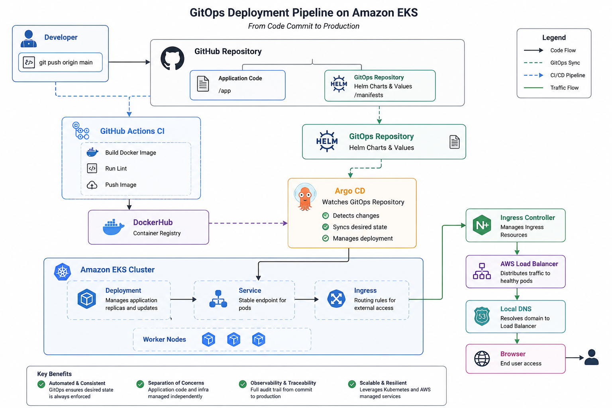

---

# Technology Stack

| Category | Technologies |
|-----------|--------------|
| Language | Go |
| Containerization | Docker |
| Container Registry | Docker Hub |
| Orchestration | Kubernetes |
| Cloud Platform | AWS |
| Kubernetes Service | Amazon EKS |
| Package Manager | Helm |
| Continuous Integration | GitHub Actions |
| Continuous Deployment | Argo CD |
| GitOps | Argo CD |
| Networking | Kubernetes Ingress |
| Ingress Controller | NGINX Ingress Controller |
| DNS | Local Hosts File |

---

# Project Workflow

The implementation follows a typical production deployment pipeline.

```text
Develop Application

↓

Containerize with Docker

↓

Push Image to Docker Hub

↓

Deploy to Kubernetes

↓

Provision Amazon EKS

↓

Configure Ingress

↓

Package using Helm

↓

Configure GitHub Actions

↓

Install Argo CD

↓

Implement GitOps

↓

Continuous Deployment
```

---

# Implementation Summary

## 1. Local Development

The application was first built and tested locally to ensure that all application endpoints worked correctly before containerization.


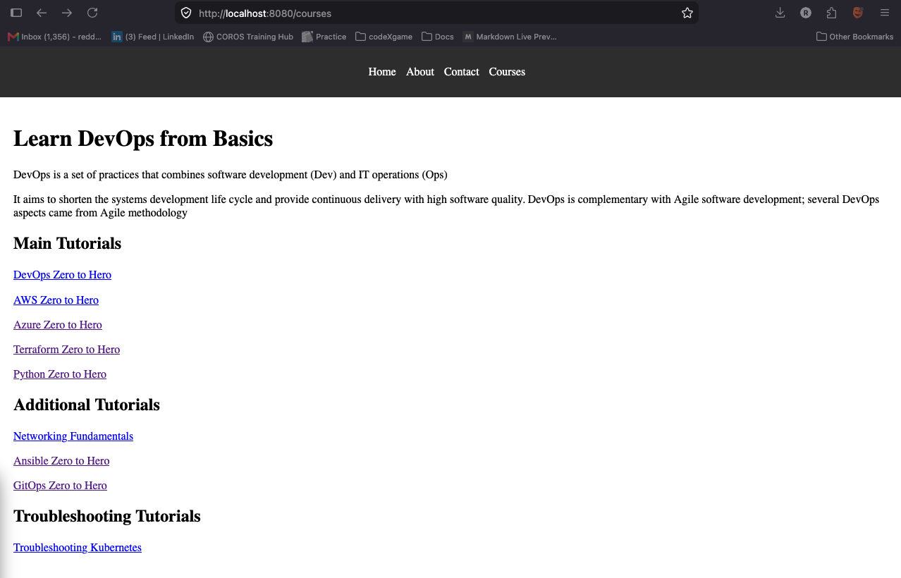


---

## 2. Docker Containerization

A multi-stage Dockerfile was created to separate the build environment from the runtime environment.

The runtime image uses Google's Distroless base image which significantly reduces the image size and attack surface.

### Benefits

- Smaller image size
- Better security
- Faster deployments
- Minimal runtime dependencies

 Docker Build Error


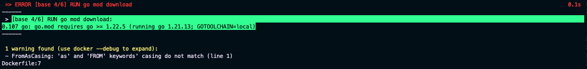


 Successful Docker Build

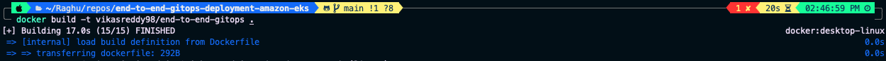

 Docker Image Push

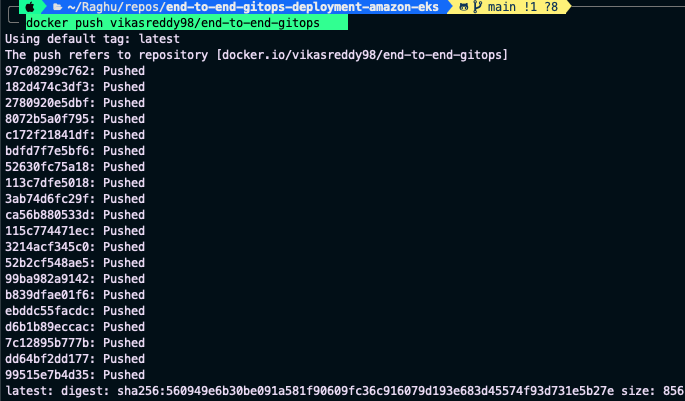

 Docker Hub Repository

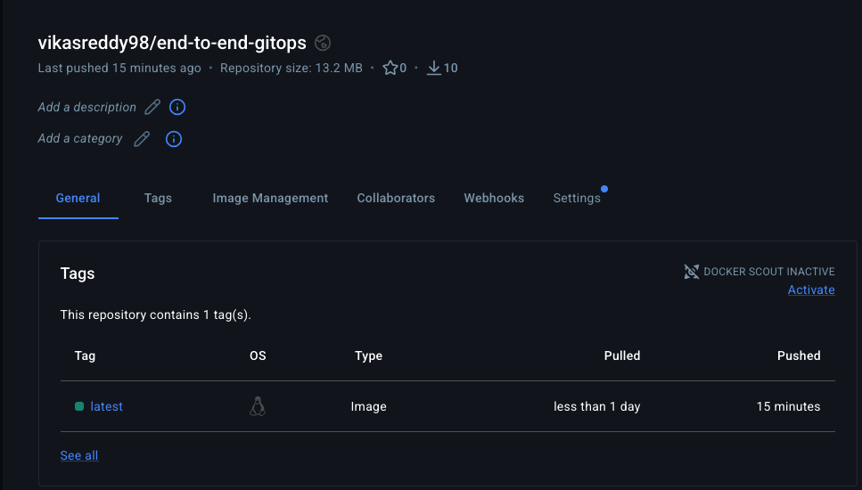

---

## 3. Kubernetes Deployment

Kubernetes manifests were created for:

- Deployment
- Service
- Ingress

The application was then deployed onto Amazon EKS.

 Deployment

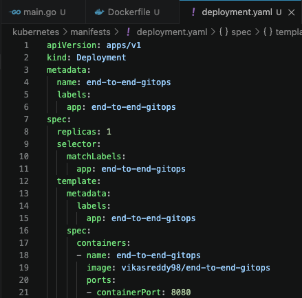

 Service

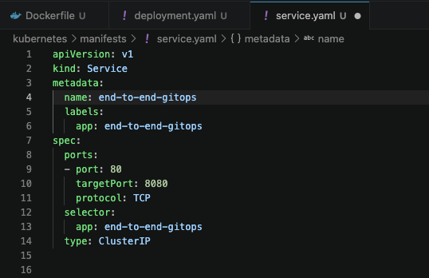

 Ingress

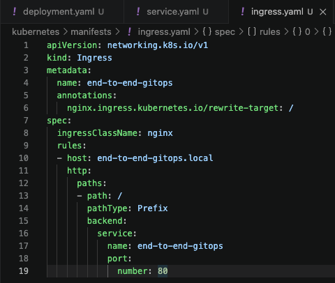

---

## 4. Amazon EKS Cluster

The Kubernetes cluster was provisioned using **eksctl**.

Worker nodes were automatically created and joined to the cluster.

 EKS Cluster


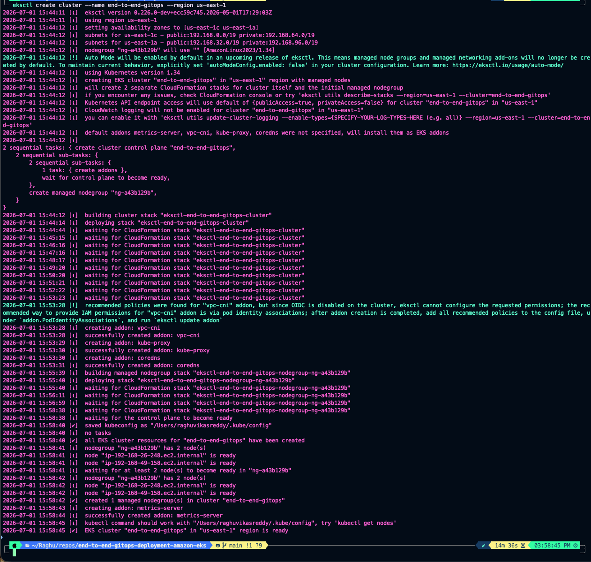


 AWS Console


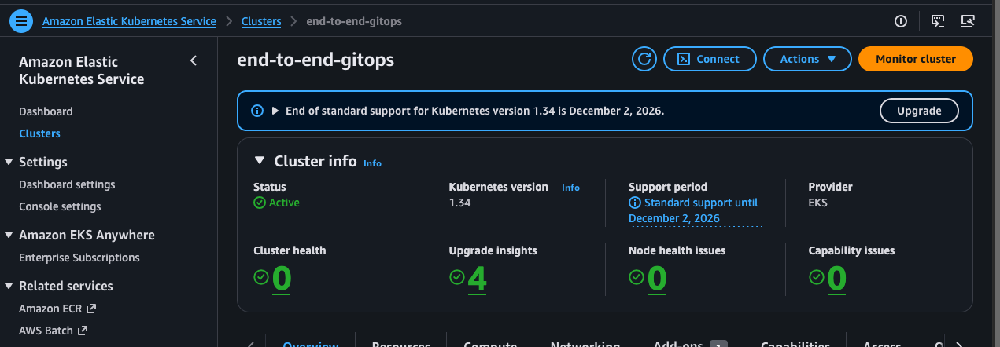


---

## 5. Troubleshooting ImagePullBackOff

One of the biggest issues encountered during deployment was the application failing to start.

The root cause was an architecture mismatch between the Docker image and the worker node platform.

The solution was to build and push a **multi-platform Docker image** using Docker Buildx.

 Error


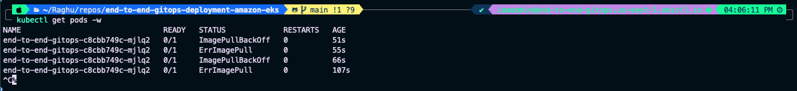


 Resolution


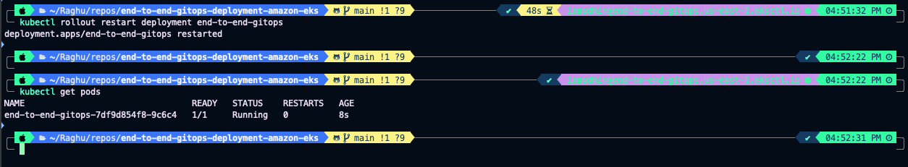


---

## 6. Kubernetes Networking

After deploying the application, Kubernetes Services and Ingress resources were configured.

Since an Ingress resource alone cannot route traffic, an NGINX Ingress Controller was installed to expose the application.

 Service & Ingress


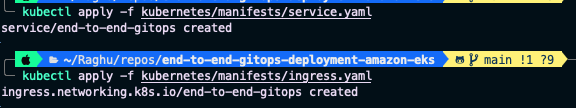


 Ingress Controller


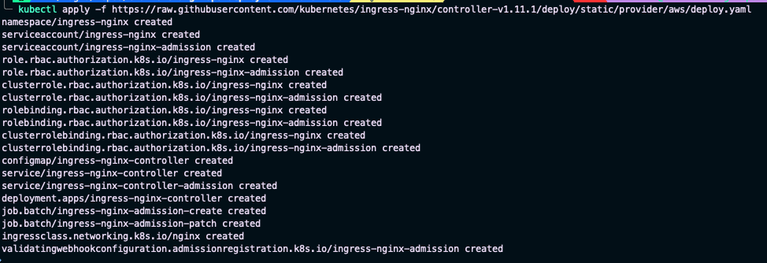


---

## 7. DNS Mapping

A local hosts file entry was added to map the configured hostname to the Ingress IP address, allowing the application to be accessed using a friendly domain name.

 DNS Configuration


 Application Access


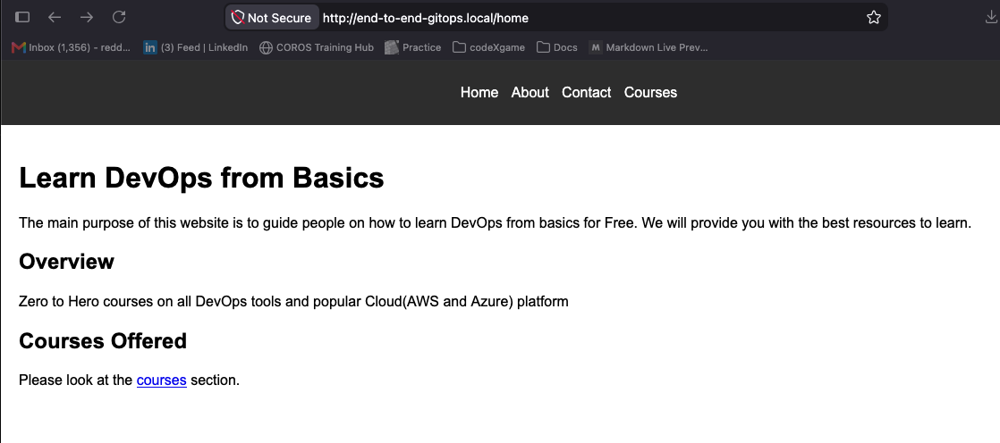


---

## 8. Helm

The Kubernetes manifests were converted into a reusable Helm chart.

This allows application versions and configuration to be managed using values rather than editing YAML files directly.

 Helm Installation


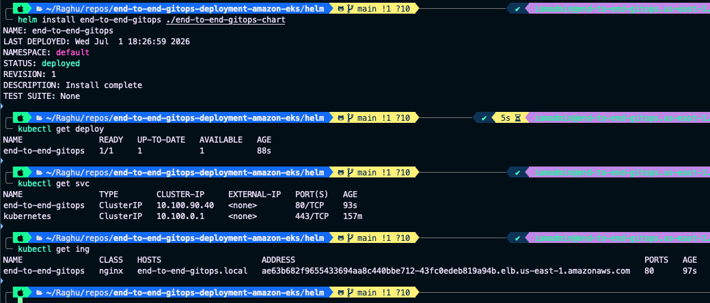


---

## 9. Continuous Integration

GitHub Actions was configured to automate the build pipeline.

The workflow performs:

- Checkout repository
- Build Go application
- Run linter
- Build Docker image
- Push image to Docker Hub

 CI Success


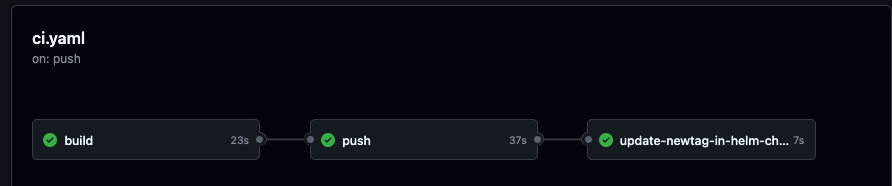


 Docker Hub Updated


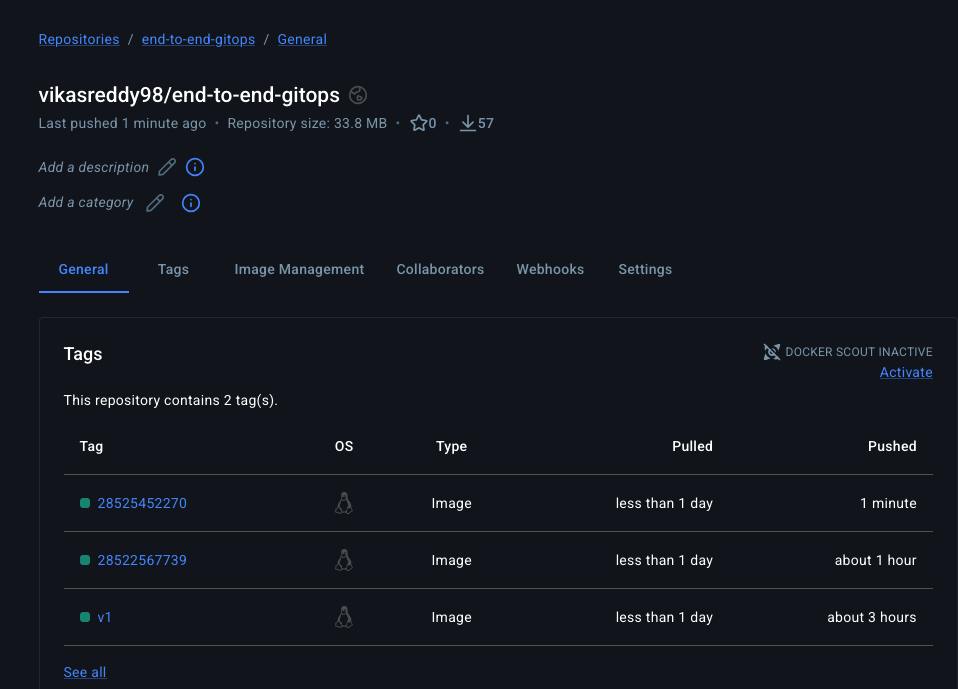


 Final CI


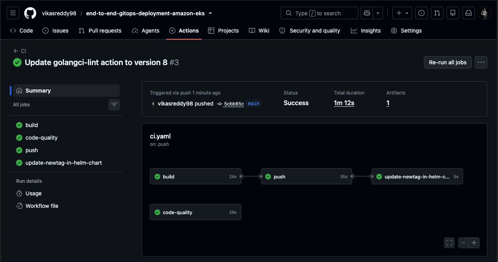


---

## 10. Continuous Deployment (GitOps)

Argo CD continuously monitors the Git repository and automatically synchronizes changes to the Kubernetes cluster.

Whenever a new image is available, Argo CD detects the updated manifests and performs a rolling deployment without manual intervention.

 Secrets


 Argo CD Installation


 Sync Successful


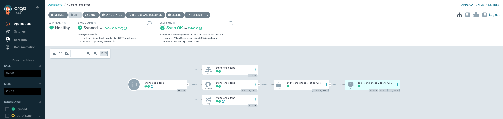


 Application Running


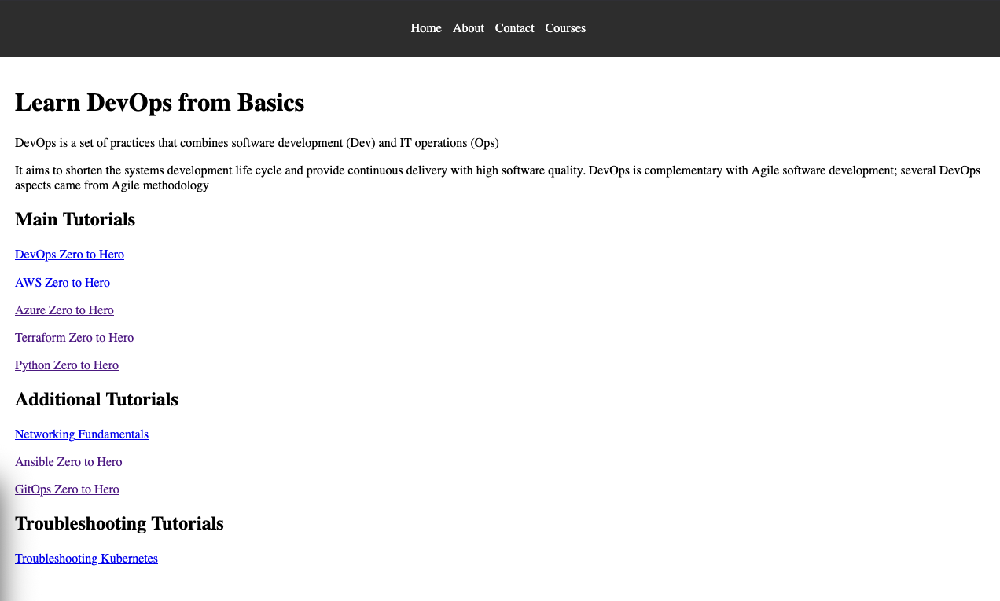


 Final Deployment


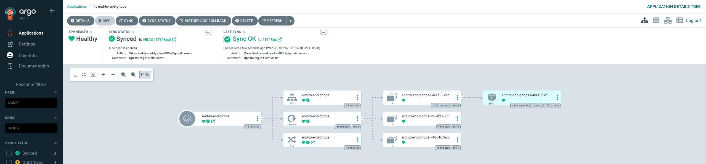


 Changes Reflected


---

# CI/CD Flow

```text
Developer

↓

Push Code

↓

GitHub Actions

↓

Run Linter

↓

Build Docker Image

↓

Push Image to Docker Hub

↓

Update Helm Values

↓

Argo CD Detects Change

↓

Sync Amazon EKS

↓

Rolling Update

↓

Application Updated
```

---

# Engineering Decisions

### Why Multi-stage Docker Builds?

Separating the build environment from the runtime environment results in significantly smaller and more secure container images.

---

### Why Distroless Images?

Distroless images remove unnecessary operating system packages, reducing both image size and security vulnerabilities.

---

### Why Helm?

Helm provides reusable templates and centralized configuration management, making deployments easier to maintain across environments.

---

### Why GitOps?

Git becomes the single source of truth for Kubernetes deployments. Every infrastructure change is version-controlled, auditable, and reproducible.

---

### Why Argo CD?

Argo CD continuously reconciles the desired state stored in Git with the actual state of the Kubernetes cluster, enabling fully automated deployments.

---

# Challenges Faced

- Go version mismatch during Docker build
- ImagePullBackOff due to architecture mismatch
- Kubernetes Ingress not exposing the application
- DNS resolution for custom hostname
- GitHub Actions linter compatibility issues
- Initial Argo CD authentication and setup

Detailed explanations are available in **TROUBLESHOOTING.md**.

---

# Lessons Learned

Throughout this project I gained practical experience with:

- Multi-stage Docker builds
- Distroless container images
- Kubernetes Deployments, Services, and Ingress
- Amazon EKS cluster management
- Helm chart templating
- GitHub Actions CI pipelines
- GitOps principles
- Argo CD continuous deployment
- Kubernetes troubleshooting
- Production-style application delivery workflows

---

# Future Improvements

- Use Amazon ECR instead of Docker Hub
- Provision infrastructure using Terraform
- Configure HTTPS using cert-manager
- Use Route 53 for DNS instead of local hosts mapping
- Integrate Prometheus and Grafana for monitoring
- Add automated security scanning
- Deploy using multiple environments (Dev, Stage, Production)

---

# Cleanup

Refer to **CLEANUP.md** for complete resource cleanup instructions.

---

# Documentation

- HOWTO.md
- TROUBLESHOOTING.md
- CLEANUP.md
- ARCHITECTURE.md

---